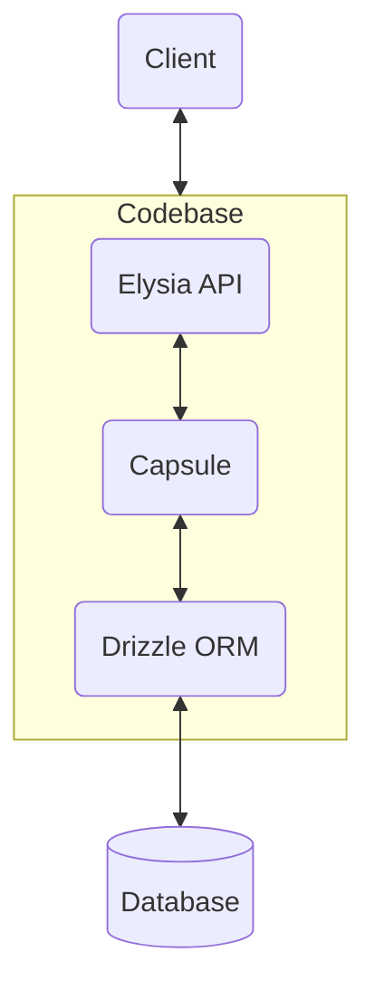

# The DELB Stack

`D`rizzle [Site](https://orm.drizzle.team/)

`E`lysia [Site](https://elysiajs.com/)

`L`ucia [Site](https://lucia-auth.com/)

`B`un [Site](https://bun.sh/)

You may notice that this doesn't include a database. We use whatever SQL service fits our use case best. This could be:

- [Supabase](https://supabase.com/)
- [Neon](https://neon.tech/)
- [Turso](https://turso.tech/)
- Bun's SQLite API
- Self hosted:
  - Postgres
  - MySQL
  - SQLite

You may also notice that there is no frontend. This is because DELB believes that the frontend and backend should remain separate. Your frontend can be whatever you're most familiar with or whatever suits your needs best. This means that DELB can be used in:

- Web Apps
- Desktop Apps
- Mobile Apps
- Plain API services
- all of the above!

# Values

1. Frontend independence
2. Simplicity
3. Transparent abstraction
4. Cloud Agnosticism
5. Portability
6. Testability

# Abstraction Model

Delb uses the following layers of abstraction:



These are:

- Client - your client code. Whatever frontend you feel like using.
- API - Your main API exposed to the internet. It is built in Elysia using a file system router. It communicates with the client over HTTP (as well as [eden treaties](https://elysiajs.com/eden/treaty). Don't slack on them.)
- Capsule - This serves as a "gateway" between your API and database. It can be mocked out to allow for testing of just the logic of the API.
- Drizzle ORM - Drizzle ORM is how you communicate with your database. It allow you to easily swap your database or cloud provider without touching your code or schema.

There's a bit of confusion around what code should go in your API routes and what should go in your capsule. In general:

- If the piece of code is part of the logic of your application, it should go in the `api` directory in its respective route, or in the `lib`
- If the piece of code deals with the actual fetching or pushing of data through drizzle, it should go in the `capsule` directory

Some helpful rules for doing this """right""":

## Testing
You should have three test groups:
  1. Logic - tests a client communicating to an API with a mocked database capsule. Should mostly focus on validating application logic.
  1. Schema - tests the capsule communicating through drizzle to validate the schema of your application.
  1. E2E - a full test of your system doing what it's supposed to do
You can bring whatever test runner you prefer. I find that bun's test runner typically does the job just fine.

# Example Project Filesystem

```
/ <my project>
  /website
    <whatever code your website needs>
  /mobile
    <whatever code your mobile app needs>
  /app --> should be its own package
    package.json
    .gitignore
    drizzle.config.ts
    migrate.ts

    /db --> Handles connection to database
    /lib --> Helper modules to keep your codebase dry
    /api --> Filesystem router, like next js
      index.ts
      users/
        index.ts
      ...
    /capsule --> Handles talking to drizzle
      user.ts
      posts.ts
    /migrations
    /tests
      /schema
        ...
      /logic
        ...
      /e2e
        ...

```

# Deploying

Since we value cloud agnosticism, DELB is designed to be deployed anywhere. Some common options are:

- [fly.io](https://fly.io) with docker
- AWS/Google with docker
- Nix (my personal favorite)

# `create-delb-app`

Create delb app is still being worked on. We plan to have options for:

- Using a minimal or preconfigured example app
- choosing your database
- using docker or nix
- bootstrapping a frontend
